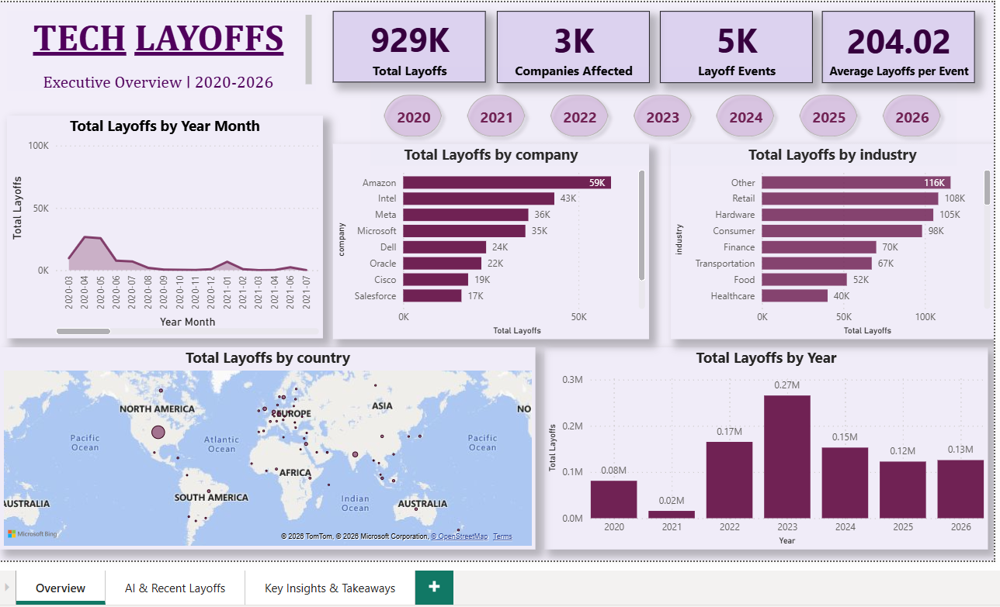
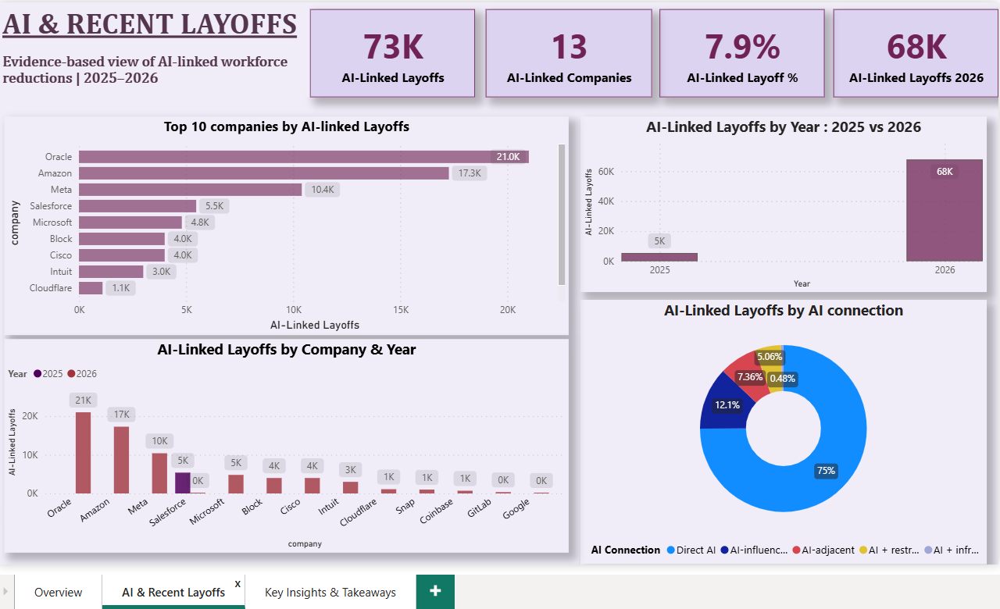
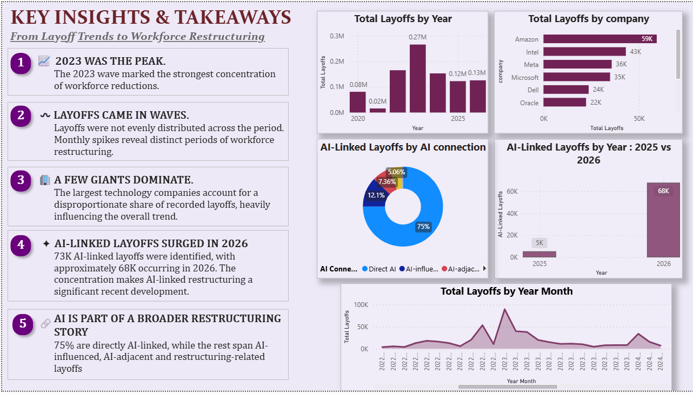

# Tech Layoffs Analysis

## 📌 Project Overview

An end-to-end analysis of global technology layoffs, examining workforce reductions across companies, industries, countries, funding stages, and time periods.

The project follows a complete data analytics workflow:

**Python → SQL → Power BI**

The analysis also explores the relationship between recent layoffs and AI adoption using a separate evidence-based AI layoff dataset.

---

## Business Questions

- How have technology layoffs changed over time?
- Which industries and companies have experienced the largest workforce reductions?
- Which countries have been most affected?
- Are layoffs concentrated among particular funding or company stages?
- How severe are layoffs across different industries and markets?
- Do highly funded companies necessarily experience smaller layoffs?
- Which companies have experienced repeated rounds of layoffs?
- How have layoff patterns changed in recent years?
- What evidence exists connecting recent layoffs with AI adoption and restructuring?

---

## Dataset

The project uses the original global layoffs dataset containing:

- **4,554 records**
- **11 variables**
- Company
- Location
- Total employees laid off
- Layoff date
- Percentage laid off
- Industry
- Source
- Funding stage
- Funds raised
- Country
- Date added

The original raw dataset is preserved in the `data/` folder.

---

## 01 — Python Analysis

Python was used as the initial exploration and analytical stage.

### Key work

- Data loading and structural inspection
- Missing-value analysis
- Duplicate checks
- Data-type validation
- Date conversion and validation
- Data-quality checks
- Cleaning and preparation
- Exploratory data analysis
- Trend analysis
- Industry analysis
- Company analysis
- Country analysis
- Funding and stage analysis
- Layoff severity analysis
- Repeated-layoff analysis
- Country × industry analysis

### Tools

- Python
- Pandas
- NumPy
- Matplotlib

The complete executed notebook is available in:

`01_Python/Layoff Project(3).ipynb`

---

## 02 — SQL Analysis

MySQL was used to structure the cleaned data and perform deeper analytical queries.

### Database structure

The project contains:

- `layoffs_clean` — cleaned analytical dataset
- `ai_layoff_evidence` — evidence-based AI layoff information

### SQL analysis includes

- Year-wise layoffs
- Industry-level impact
- Company-level impact
- Country-level impact
- Layoff severity
- Funding analysis
- Company-stage analysis
- Repeated layoffs
- AI-related layoff evidence

The final MySQL database backup is available in:

`02_SQL/tech_layoffs_analysis_backup.sql`

---

## AI & Layoffs

Recent layoffs were examined separately through an evidence-based AI layer rather than assuming that every technology layoff was caused by AI.

The AI evidence table records:

- Company
- Year
- AI connection
- Reason category
- Evidence summary
- Evidence source
- Confidence level

This distinction helps separate **direct AI-driven workforce reductions** from broader restructuring or layoffs occurring alongside AI investment.

---

## 03 — Power BI

Power BI is used as the final visualization and business-intelligence layer of the project.

### Dashboard

The final dashboard is organized into three pages:

1. **Overview** — overall layoff trends across companies, industries, countries, and years.
2. **AI & Recent Layoffs** — evidence-based analysis of AI-linked layoffs and their recent concentration.
3. **Key Insights & Takeaways** — key findings connecting overall layoff patterns with AI-linked workforce restructuring.

### Dashboard Preview

#### 1. Overview



#### 2. AI & Recent Layoffs



#### 3. Key Insights & Takeaways



The Power BI source file is available in:

`03_PowerBI/Layoffs_Project.pbix`
---

## Key Analytical Themes

The analysis highlights several recurring patterns in the technology layoff landscape:

- Layoffs vary significantly across industries and years.
- Workforce reductions are concentrated among certain industries and major technology markets.
- Layoff severity differs considerably between companies.
- Funding and company stage provide useful context but do not independently explain layoff outcomes.
- Some companies experience multiple rounds of workforce reductions.
- Recent layoffs increasingly coincide with organizational restructuring and AI-related workforce changes.
- AI should be treated as one factor within a broader restructuring environment rather than as the sole explanation for technology layoffs.

---

## 🛠️ Tech Stack

| Tool | Purpose |
|---|---|
| Python | Data cleaning, exploration & analysis |
| Pandas | Data manipulation |
| NumPy | Numerical analysis |
| Matplotlib | Data visualization |
| MySQL | Data storage & analytical SQL |
| Power BI | Dashboarding & business intelligence |
| DAX | Measures & calculations |
| Power Query | Data transformation |
| GitHub | Project documentation & version control |

---

## Project Structure

```text
tech-layoffs-analysis/
│
├── 01_Python/
│   └── Layoff Project(3).ipynb
│
├── 02_SQL/
│   └── tech_layoffs_analysis_backup.sql
│
├── 03_PowerBI/
│   ├── Layoffs_Project.pbix
│   ├── 01_overview.png
│   ├── 02_ai_recent_layoffs.png
│   └── 03_key_insights.png
│
├── data/
│   └── layoffs.csv
│
├── .gitignore
└── README.md
```

## About the Project

This project was built as an end-to-end data analytics portfolio project to demonstrate the ability to move from raw data to structured analysis and finally to business-focused visualization.

**Workflow:**

Raw Data → Python → SQL → Power BI → Insights

